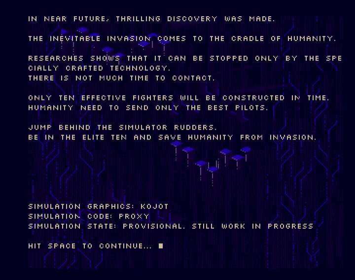
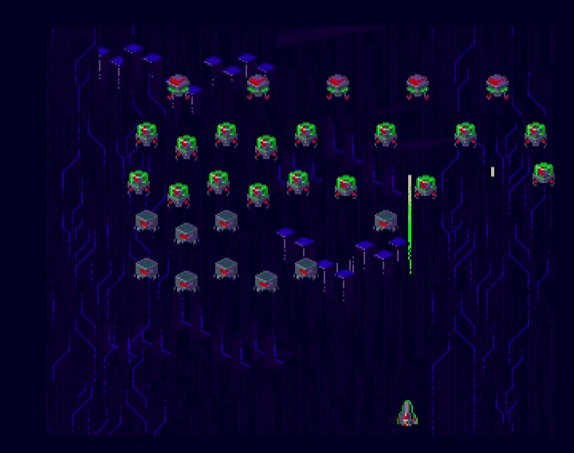

# amiga-invaders

Yet another clone of Space Ivaders game




## Getting Started

In near future, thrilling discovery was made.

The inevitable invasion comes to the cradle of humanity.

Researches shows that it can be stopped only by the specially crafted technology.  
There is not much time to contact.

Only ten effective fighters will be constructed in time.  
Humanity need to send only the best pilots.

Jump behind the simulator rudders.  
Be in the elite ten and save humanity from invasion.

### Pre-requirements

This game is made for specific hardware. To properly run this game you will need:

* Literally any Amiga (but tested with Amiga 500 and Kickstart 1.3)

or compatible Amiga emulator like [WinUAE](http://www.winuae.net/).

### Installing

Copy the [latest game release](https://github.com/approxit/amiga-invaders/releases) archive and extract to directory that Amiga can load. The `bin` and `data` directories must coexist as given. 

### Running the game

Game must be stared from main executable file located in `bin/amiga-invaders`.
In AmigaDOS CLI you can use following commands:

```
1> cd amiga-invaders/bin
1> amiga-invaders
``` 

## Controls

### Intro

* **<kbd>space</kbd> / <kbd>return</kbd>** - speeds up text

* **<kbd>escape</kbd>** - quits game

### Map

* **<kbd>a</kbd> / <kbd>left</kbd>** - turns ship left
* **<kbd>d</kbd> / <kbd>right</kbd>** - turns ship right
* **<kbd>space</kbd> / <kbd>return</kbd>** - fires ship projectile

* **<kbd>escape</kbd>** - quits game

## Built With

* [Amiga C Engine](https://github.com/approxit/ACE) - game engine
* [amiga-dev](https://github.com/kusma/amiga-dev) - VBCC+VASM+VLINK development environment
* [Photoshop](http://www.adobe.com/products/photoshop.html) - graphics editor

## Versioning

This project use [SemVer](http://semver.org/) for versioning. For the versions available, see the [tags on this repository](https://github.com/approxit/amiga-invaders/tags). 

## Authors

* **Koyot1222** - graphics
* **[approxit](https://github.com/approxit)** - initial code

## License

This project is licensed under the MIT License - see the [LICENSE.md](LICENSE.md) file for details.